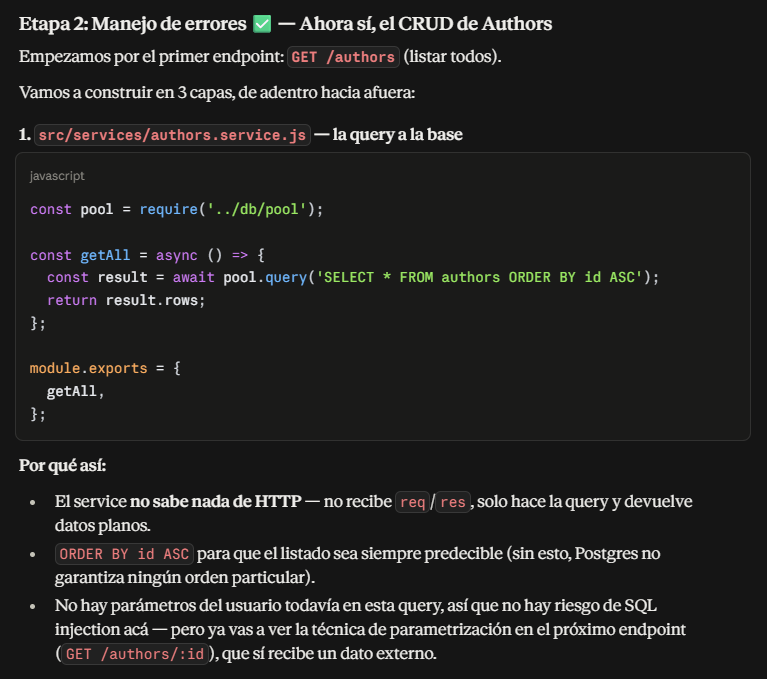
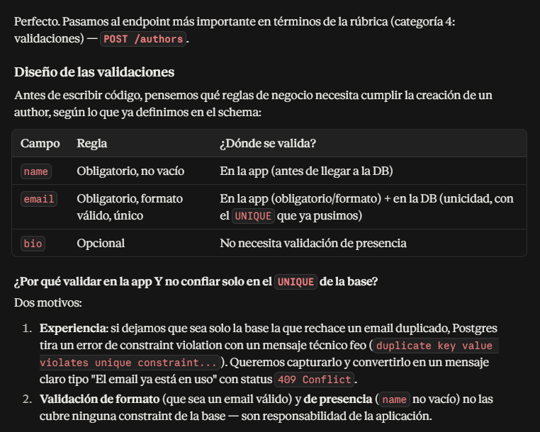
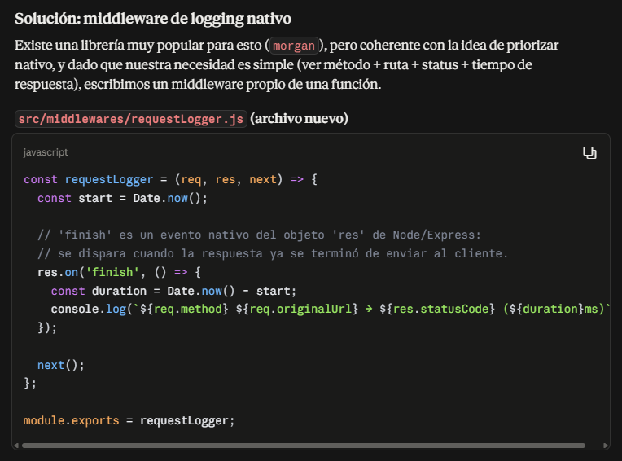
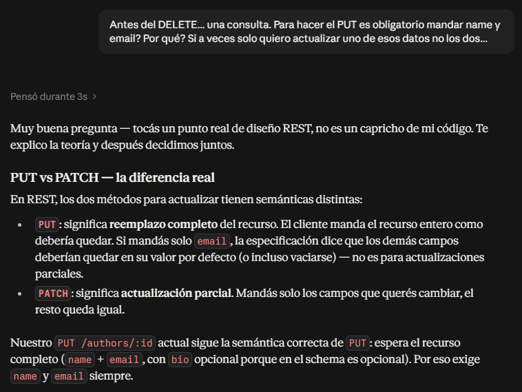
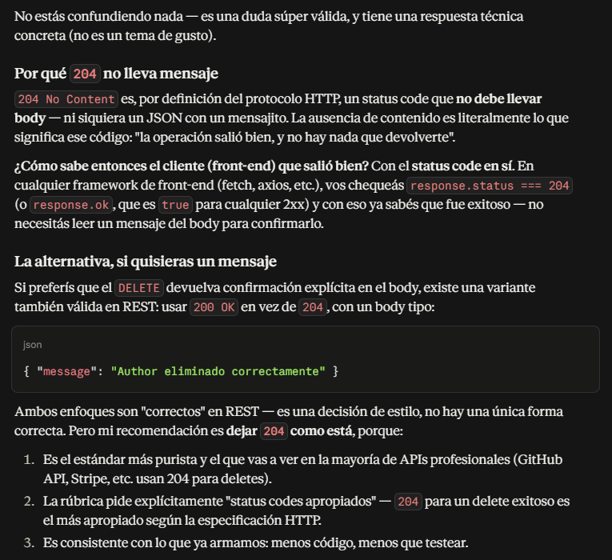
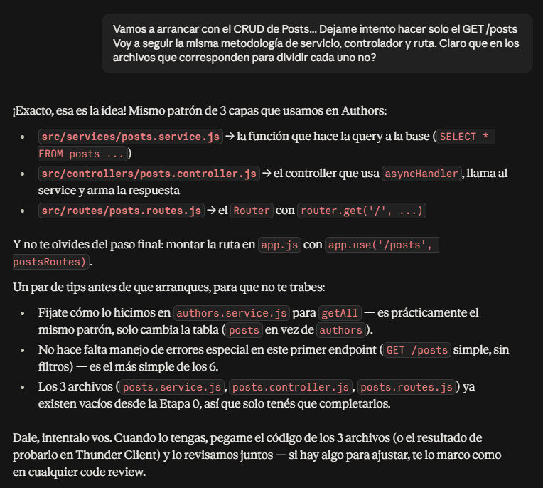
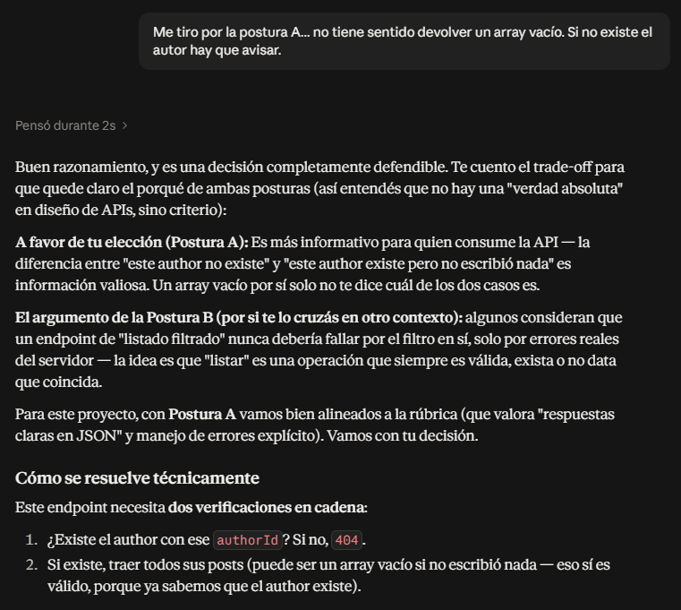
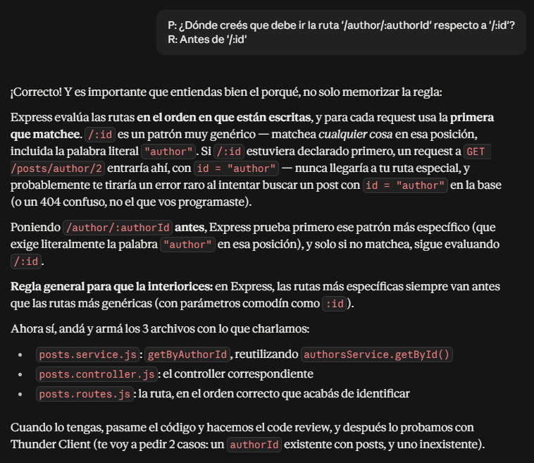

## Sesión 1 — Etapa 0: Setup del proyecto

**Herramienta:** Claude (Anthropic)

**Prompts principales y resultados:**

1. Prompt: Definición del rol de tutor y desglose inicial de etapas del proyecto según consigna.
   Resultado: Plan de 8 etapas (setup, DB, CRUD authors, CRUD posts, testing, OpenAPI, deploy, cierre).

    

2. Prompt: Corrección de alcance según rúbrica (entidad "authors" no "users", endpoint
   /posts/author/:authorId obligatorio).
   Resultado: Ajuste del plan y tabla de mapeo rúbrica → etapas.

3. Prompt: Consultas sobre buenas prácticas de conexión a PostgreSQL (uso de superusuario
   vs. usuario dedicado).
   Resultado: Decisión de crear usuario `api_user` con privilegios acotados, aplicando
   principio de mínimo privilegio. Se creó y verificó la conexión con el nuevo usuario.

    

4. Prompt: Manejo de variables de entorno sin dependencias externas.
   Resultado: Uso de `process.loadEnvFile()` (API nativa de Node 20.12+) en lugar del
   paquete `dotenv`, alineado con la recomendación del instructor de priorizar soluciones nativas.

**Aprendizajes clave de la sesión:**

- Separación en capas (routes/controllers/services) desde el inicio del proyecto.
- Principio de mínimo privilegio aplicado a usuarios de base de datos.
- Alternativas nativas de Node a paquetes npm comunes (dotenv → loadEnvFile).

## Sesión 1 (continuación) — Conexión Express-PostgreSQL

**Prompts principales y resultados:**

5. Prompt: Implementación del módulo de conexión a PostgreSQL con Pool.
   Resultado: Se explicó la diferencia entre Pool y Client, y por qué Pool es obligatorio
   para una API que atiende múltiples requests concurrentes. Código de `src/db/pool.js`
   aprovechando las variables de entorno estándar del driver `pg`.

    

6. Prompt: Creación de servidor Express mínimo con endpoint de verificación.
   Resultado: Separación entre `app.js` (configuración de Express) y `server.js` (arranque
   del servidor), patrón que facilita testing en etapas posteriores. Endpoint `/health`
   con query real a la base para validar la conexión de punta a punta.

    

**Aprendizajes clave:**

- Diferencia entre `Pool` y `Client` en el driver `pg`, y por qué Pool es el estándar
  para APIs REST.
- Importancia del orden de carga: variables de entorno deben cargarse antes de crear
  el Pool de conexiones.
- Separación `app.js`/`server.js` como patrón que facilita testing automatizado.

## Sesión 1 (continuación) — Etapa 1: Modelado de datos

**Prompts principales y resultados:**

7. Prompt: Diseño de constraints y tipos de datos para el schema (authors/posts) según
   atributos definidos en la consigna.
   Resultado: Tabla de tipos y constraints (SERIAL, VARCHAR, TEXT, BOOLEAN, TIMESTAMP,
   NOT NULL, UNIQUE) justificando cada decisión contra los requisitos de la rúbrica.

    

8. Prompt: Consulta sobre comportamiento de FK al eliminar un author con posts asociados.
   Resultado: Explicación de CASCADE vs RESTRICT; se eligió CASCADE.

9. Prompt: Troubleshooting de caracteres acentuados mostrados incorrectamente en consola
   tras ejecutar el seed (ej. "García" → "Garc├¡a").
   Resultado: Diagnóstico paso a paso descartando causas (encoding del archivo, codepage
   de Windows) hasta confirmar con `length()`/`octet_length()` en SQL que los datos
   estaban correctamente almacenados en UTF-8, y que el problema era únicamente de
   renderizado en la terminal Git Bash/mintty, sin impacto real en la aplicación.

**Aprendizajes clave:**

- Diseño de constraints relacionales (PK, FK, UNIQUE, DEFAULT) alineado a requisitos
  de negocio y de rúbrica.
- Diferencia entre CASCADE y RESTRICT en foreign keys.
- Técnica de diagnóstico de encoding usando `length()` vs `octet_length()` en PostgreSQL
  para distinguir un problema real de datos de un problema de visualización en terminal.

## Sesión 2 — Etapa 2: Manejo global de errores

**Prompts principales y resultados:**

10. Prompt: Diseño de un sistema de manejo de errores centralizado antes de construir
    el CRUD, para evitar refactorizar cada controller después.
    Resultado: Arquitectura de 3 piezas (AppError, asyncHandler, errorHandler middleware),
    todas con JavaScript nativo, sin dependencias externas como express-async-errors.
    Se explicó la convención de Express de identificar middlewares de error por su firma
    de 4 parámetros, y la importancia del orden de declaración de middlewares en app.js.

    

**Aprendizajes clave:**

- Patrón de clase de error personalizada (AppError) para distinguir errores operacionales
  de bugs internos.
- Por qué Express no captura automáticamente errores de funciones async, y cómo resolverlo
  con un wrapper propio en vez de una dependencia.
- Orden correcto de middlewares en Express: rutas → 404 handler → error handler (siempre
  al final).

## Sesión 2 (continuación) — Etapa 2: CRUD de Authors

**Prompts principales y resultados:**

11. Prompt: Implementación de GET /authors y GET /authors/:id.
    Resultado: Se introdujo el concepto de queries parametrizadas ($1, $2) como
    prevención de SQL injection, explicando por qué nunca concatenar valores en
    template literals dentro de una query SQL.

12. Prompt: Implementación de POST /authors con validaciones. Creación del middleware de logging nativo.
    Resultado: Validación manual (sin express-validator/zod) de campos obligatorios
    y formato de email; manejo del código de error 23505 de PostgreSQL para traducir
    violación de unicidad en respuesta 409 con mensaje claro.

    

    

13. Prompt: Consulta sobre si PUT debía aceptar actualizaciones parciales.
    Resultado: Se explicó la diferencia semántica entre PUT (reemplazo completo) y
    PATCH (actualización parcial) en REST. Se decidió mantener PUT como reemplazo
    completo, alineado con la consigna y sin agregar PATCH, para respetar el alcance
    acotado del proyecto y los principios REST evaluados en la rúbrica.

    

14. Prompt: Implementación de DELETE /authors/:id y duda sobre por qué no devuelve
    mensaje en el body.
    Resultado: Se explicó la semántica del status 204 No Content (no debe llevar body
    por especificación HTTP) y cómo el cliente debe usar el status code, no el body,
    para confirmar éxito. Se verificó el comportamiento ON DELETE CASCADE en la base
    de datos tras un borrado exitoso.

    

**Aprendizajes clave:**

- Prevención de SQL injection mediante queries parametrizadas.
- Manejo de errores específicos de PostgreSQL (código 23505) traducidos a respuestas
  HTTP semánticamente correctas.
- Diferencia semántica REST entre PUT y PATCH, y cuándo usar cada uno.
- Uso correcto de status 204 No Content y su implicancia de no llevar body.
- Verificación de integridad referencial (ON DELETE CASCADE) a nivel de base de datos.

## Sesión 3 — Etapa 3: Endpoints GET de Posts

**Prompts principales y resultados:**

15. Prompt: Implementación guiada (con intentos propios del alumno) de GET /posts,
    GET /posts/:id y GET /posts/author/:authorId.
    Resultado: Se revisó código propio en cada paso (code review), corrigiendo dos
    errores puntuales: falta de `await` en una llamada a función async, y query
    filtrando por la columna incorrecta (`id` en vez de `author_id`).

    

16. Prompt: Discusión de diseño sobre qué debía pasar si /posts/author/:authorId
    recibe un authorId inexistente (404 vs array vacío).
    Resultado: Se eligió devolver 404, reutilizando authorsService.getById() para
    no duplicar la lógica de verificación de existencia de un author.

    

17. Prompt: Consulta sobre el orden correcto de declaración de rutas en Express
    cuando coexisten un patrón específico (/author/:authorId) y uno genérico (/:id).
    Resultado: Explicación de por qué Express evalúa rutas en orden secuencial y
    usa la primera que matchea, y por qué las rutas específicas deben declararse
    antes que las genéricas con parámetros comodín.

    

**Aprendizajes clave:**

- Importancia de `await` en llamadas a funciones async dentro de otra función async.
- Diferencia entre filtrar por primary key (id) y por foreign key (author_id).
- Reutilización de lógica de validación entre services relacionados (posts → authors).
- Orden de declaración de rutas en Express y su impacto en el matching de requests.
